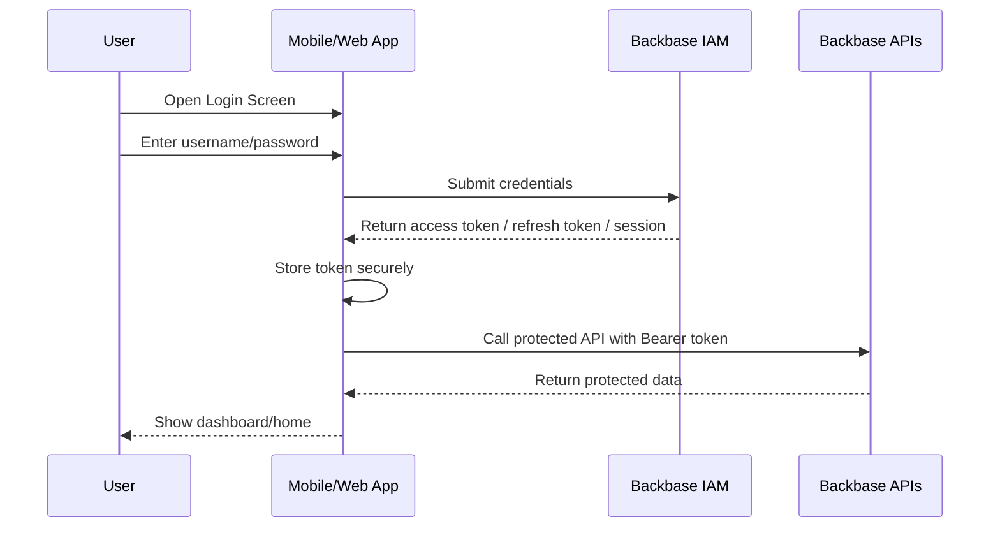

# 01 - IAM Authentication & Secure Login Journey

## 1. Objective

This journey explains how a user securely signs in to the mobile/web application using Backbase IAM. The output of this journey is a valid authenticated session/token that can be used to access protected Backbase APIs.

## 2. Actors / Systems

| Actor/System | Role |
|---|---|
| User | Enters credentials and initiates login |
| Mobile/Web App | Captures credentials and calls authentication APIs |
| Backbase IAM | Validates identity and issues tokens/session |
| API Gateway / Edge Services | Validates token for downstream API calls |
| Downstream Backbase Services | Account, party, transaction, entitlement, and profile APIs |

## 3. Preconditions

- User is already registered in the identity system.
- User account is active and not locked/suspended.
- App has valid client configuration.
- IAM base URL/environment is configured.
- TLS/HTTPS is enabled.

## 4. High-Level Flow



## 5. Step-by-Step Sequence

| Step | Screen/Action | API/Service | Input | Output | Dependency |
|---|---|---|---|---|---|
| 1 | User opens app | N/A | App launch | Login screen | None |
| 2 | User enters credentials | N/A | Username, password | Validated form data | None |
| 3 | User taps Sign In | IAM Authentication API | Username, password, client details | Auth request submitted | Valid form fields |
| 4 | IAM validates credentials | Backbase IAM | Credentials | Success/failure | User must exist and be active |
| 5 | Token/session is issued | Token endpoint/Auth response | Successful authentication | Access token, refresh token, expiry | Step 4 success |
| 6 | App stores token | Secure storage | Token data | Token available for API calls | Step 5 success |
| 7 | App fetches user context | User/Profile/Session API | Access token | User/party/session context | Step 5 token |
| 8 | App navigates to dashboard | N/A | Valid session | Home/dashboard | Step 7 success or optional |

## 6. API Details

### 6.1 Authentication / Login API

**Purpose:** Authenticate user credentials and start secure session.

**Method:** `POST`  
**Endpoint:** `To be confirmed from Backbase IAM API reference`  
**Example placeholder:** `/auth/login` or `/oauth/token`

#### Request Headers

```http
Content-Type: application/json
Accept: application/json
```

#### Request Body - Placeholder

```json
{
  "username": "user@example.com",
  "password": "********",
  "client_id": "mobile-app-client",
  "grant_type": "password"
}
```

#### Success Response - Placeholder

```json
{
  "access_token": "eyJhbGciOi...",
  "refresh_token": "eyJhbGciOi...",
  "token_type": "Bearer",
  "expires_in": 3600,
  "scope": "openid profile accounts transactions"
}
```

#### Dependencies

- No previous API dependency.
- Requires valid user credentials.
- Requires valid client/environment configuration.

#### Output Used By

- User context/profile API
- Account list API
- Transaction API
- Any secured Backbase domain API

## 7. Validation Rules

| Field | Rule |
|---|---|
| Username | Mandatory; format as configured by IAM, usually email/user ID |
| Password | Mandatory; do not log or persist as plain text |
| Client ID | Must match configured application client |
| Environment URL | Must be aligned with target Backbase environment |

## 8. Error Handling

| Scenario | Expected Status | UI Behaviour |
|---|---|---|
| Invalid credentials | 400/401 | Show invalid username/password message |
| Account locked | 423/403 | Show account locked message and support path |
| Password expired | 403 | Redirect to password reset/change flow if supported |
| MFA required | 202/401 with challenge | Navigate to MFA/OTP screen |
| Network timeout | 408/timeout | Show retry option |
| Server error | 500/503 | Show generic service unavailable message |

## 9. Security Notes

- Never log username/password or tokens.
- Store token only in platform-secure storage.
- Use HTTPS only.
- Clear token on logout, token expiry failure, or unauthorized response.
- Use refresh-token flow only if supported and approved.

## 10. Open Confirmation Items

| Item | Owner | Status |
|---|---|---|
| Exact IAM login endpoint | Backbase/API owner | Open |
| Exact request body schema | Backbase/API owner | Open |
| MFA/OTP requirement | Product/API owner | Open |
| Token expiry and refresh behaviour | Backbase/IAM owner | Open |
