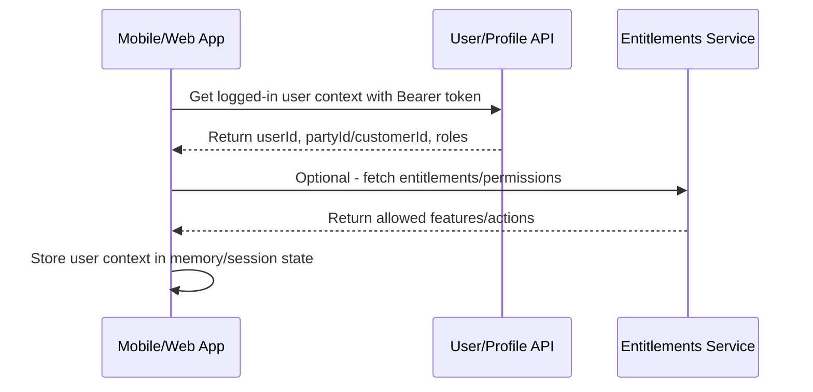

# 02 - User Context & Session Journey

## 1. Objective

After successful login, the application must identify the authenticated user, user roles/entitlements, party/customer reference, and any session-level information needed for subsequent journeys.

## 2. High-Level Flow



## 3. Step-by-Step Sequence

| Step | Action | API | Input | Output | Dependency |
|---|---|---|---|---|---|
| 1 | Login completed | N/A | Access token | Authenticated session | Login journey |
| 2 | Fetch user profile/context | User/Profile API | Access token | User ID, party ID/customer ID, username | Valid access token |
| 3 | Fetch roles/entitlements | Entitlements API | Access token, user ID | Permissions/allowed features | User context |
| 4 | Store context | App state | User context | Available for journeys | Step 2/3 |
| 5 | Route user | App navigation | Role/permissions | Dashboard/home | Context resolved |

## 4. API Details

### 4.1 User Profile / Context API

**Method:** `GET`  
**Endpoint:** `To be confirmed from API reference`  
**Example placeholder:** `/users/me` or `/user/profile`

#### Headers

```http
Authorization: Bearer <access_token>
Accept: application/json
```

#### Success Response - Placeholder

```json
{
  "userId": "user-123",
  "username": "user@example.com",
  "fullName": "John Doe",
  "partyId": "party-456",
  "customerId": "customer-789",
  "roles": ["RetailUser"],
  "status": "ACTIVE"
}
```

### 4.2 Entitlements / Permissions API

**Method:** `GET`  
**Endpoint:** `To be confirmed from API reference`

#### Dependencies

- Requires access token.
- May require user ID or party/customer ID from User Profile API.

## 5. Dependency Mapping

| Data | Source | Used By |
|---|---|---|
| `access_token` | Login API | All secured APIs |
| `userId` | User Profile API | Entitlements, audit, user preferences |
| `partyId/customerId` | User Profile/Party API | Accounts, onboarding, customer profile |
| `roles/permissions` | Entitlements API | Menu visibility, feature access |

## 6. Error Handling

| Scenario | UI/API Behaviour |
|---|---|
| 401 Unauthorized | Clear session and redirect to login |
| User context missing | Show generic login/session error |
| Entitlements unavailable | Hide restricted actions or show fallback |
| Party ID missing | Do not call account APIs until resolved |

## 7. Open Items

- Confirm exact source of `partyId`, `customerId`, or membership ID.
- Confirm whether entitlements are mandatory before dashboard load.
- Confirm role names and permission model.
