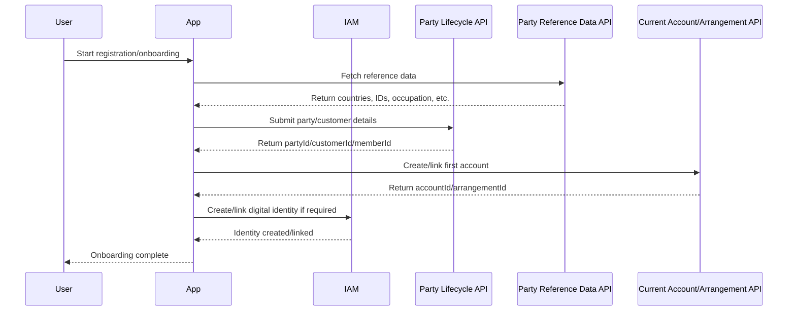

# 03 - Member Onboarding, Party & Account Creation Journey

## 1. Objective

This journey documents a typical member onboarding flow where the user/member is created or identified, party reference data is managed, membership/customer reference is generated, and the first/current account is created or linked.

## 2. Important Backbase Domains

| Domain/Service | Purpose |
|---|---|
| Party Lifecycle | Create/update/manage party/person/customer lifecycle |
| Party Reference Data Directory | Reference data required during onboarding |
| Current Account / Arrangement | Create/link account or account arrangement |
| IAM | User authentication and identity |
| Entitlements | Assign allowed access after onboarding |

## 3. High-Level Flow



## 4. Step-by-Step Sequence

| Step | Action | API/Domain | Input | Output | Dependency |
|---|---|---|---|---|---|
| 1 | Start onboarding | N/A | User starts flow | Registration form | None |
| 2 | Load reference data | Party Reference Data API | Access token/public config | Countries, ID types, etc. | Environment config |
| 3 | Capture personal details | N/A | Name, DOB, contact, address | Validated form | Reference data |
| 4 | Submit party details | Party Lifecycle API | Personal/KYC data | `partyId/customerId/memberId` | Valid form data |
| 5 | Create/link account | Current Account/Arrangement API | Party/customer ID | `accountId/arrangementId` | Step 4 output |
| 6 | Create/link identity | IAM/User API | User contact + party/customer ID | Digital user identity | Step 4 output |
| 7 | Assign entitlements | Entitlements API | User ID, role, arrangement | Permissions | Identity/account created |
| 8 | Complete onboarding | N/A | All required IDs | Success screen/login | Previous steps success |

## 5. API Details

### 5.1 Party Reference Data API

**Purpose:** Provides reference/master data used in onboarding forms.

**Method:** `GET`  
**Endpoint:** `To be confirmed from API reference`

**Example Response - Placeholder**

```json
{
  "countries": ["US", "IN", "UK"],
  "idTypes": ["PASSPORT", "DRIVING_LICENSE"],
  "employmentStatuses": ["EMPLOYED", "SELF_EMPLOYED", "RETIRED"]
}
```

### 5.2 Party Lifecycle API

**Purpose:** Creates or updates customer/party record.

**Method:** `POST`  
**Endpoint:** `To be confirmed from API reference`

**Request Body - Placeholder**

```json
{
  "firstName": "John",
  "lastName": "Doe",
  "dateOfBirth": "1990-01-01",
  "email": "john.doe@example.com",
  "mobileNumber": "+10000000000",
  "address": {
    "line1": "Address line 1",
    "city": "City",
    "country": "US"
  }
}
```

**Success Response - Placeholder**

```json
{
  "partyId": "party-456",
  "customerId": "customer-789",
  "membershipId": "member-001",
  "status": "CREATED"
}
```

### 5.3 Current Account / Arrangement API

**Purpose:** Creates or links the first/current account for the party/customer.

**Method:** `POST`  
**Endpoint:** `To be confirmed from API reference`

**Dependency:** Requires `partyId` or `customerId` from Party Lifecycle API.

**Success Response - Placeholder**

```json
{
  "accountId": "acc-001",
  "arrangementId": "arr-001",
  "accountNumberMasked": "****1234",
  "status": "ACTIVE"
}
```

## 6. Dependency Mapping

| Output | Generated By | Required For |
|---|---|---|
| Reference data | Party Reference Data API | Form dropdowns/validation |
| `partyId` | Party Lifecycle API | Account creation/linking |
| `customerId/memberId` | Party Lifecycle/Core system | Account, user profile, membership mapping |
| `accountId/arrangementId` | Current Account/Arrangement API | Account summary, transaction history |
| `userId` | IAM/User API | Login and entitlements |

## 7. Error Handling

| Scenario | Expected Handling |
|---|---|
| Duplicate party/customer | Show existing member/contact support path |
| Missing reference data | Do not submit onboarding; show retry |
| Party creation failed | Preserve form data and show error |
| Account creation failed after party creation | Mark journey incomplete; support retry/reconciliation |
| Identity creation failed | Party exists but digital access pending; show actionable message |

## 8. Open Items

- Confirm exact order: identity first or party first.
- Confirm whether account creation happens in Backbase, Symitar/core, or integration layer.
- Confirm source of membership ID and platform ID/UPID.
- Confirm duplicate detection fields.
