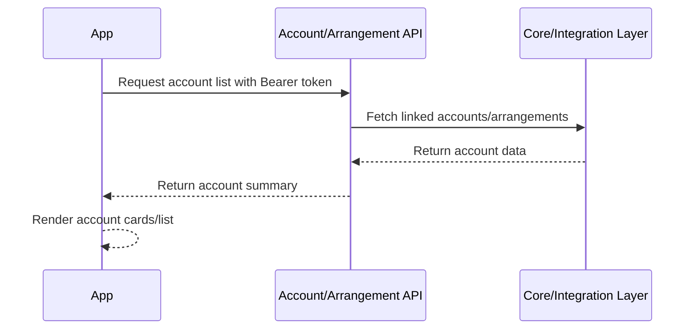

# 04 - Account Summary / Account List Journey

## 1. Objective

This journey explains how the app displays the list of accounts/arrangements for the authenticated user after login.

## 2. High-Level Flow



## 3. Step-by-Step Sequence

| Step | Action | API | Input | Output | Dependency |
|---|---|---|---|---|---|
| 1 | User logs in | IAM | Credentials | Access token | Login journey |
| 2 | User context resolved | User/Profile API | Token | Party/customer ID | User context journey |
| 3 | App calls account list | Account/Arrangement API | Token, optional party/customer ID | Account list | Token + context |
| 4 | App displays accounts | N/A | Account list | UI account cards | Step 3 success |

## 4. API Details

### 4.1 Account List / Arrangement API

**Method:** `GET`  
**Endpoint:** `To be confirmed from API reference`  
**Example placeholder:** `/accounts` or `/arrangements`

#### Headers

```http
Authorization: Bearer <access_token>
Accept: application/json
```

#### Query Parameters - Placeholder

| Parameter | Required | Description |
|---|---|---|
| `customerId` | Conditional | Required if API does not derive customer from token |
| `productKind` | Optional | Filter account type |
| `status` | Optional | Active/closed/dormant filter |

#### Success Response - Placeholder

```json
{
  "accounts": [
    {
      "accountId": "acc-001",
      "arrangementId": "arr-001",
      "displayName": "Everyday Checking",
      "accountNumberMasked": "****1234",
      "currency": "USD",
      "availableBalance": 1500.25,
      "currentBalance": 1600.25,
      "status": "ACTIVE"
    }
  ]
}
```

## 5. Dependency Mapping

| Data | Source | Used For |
|---|---|---|
| Access token | Login API | Authorization |
| Party/customer ID | User/Party API | Account filtering if required |
| Account ID / Arrangement ID | Account API | Transaction history, account detail |

## 6. UI Behaviour

- Show loading while accounts are being fetched.
- Show empty state if no account is linked.
- Mask account number.
- Do not show sensitive data in logs.
- Use account ID/arrangement ID internally for navigation.

## 7. Error Handling

| Scenario | Behaviour |
|---|---|
| 401 Unauthorized | Redirect to login/session expired |
| 403 Forbidden | Show access not allowed |
| No accounts | Show empty account state |
| Core unavailable | Show retry/service unavailable |
