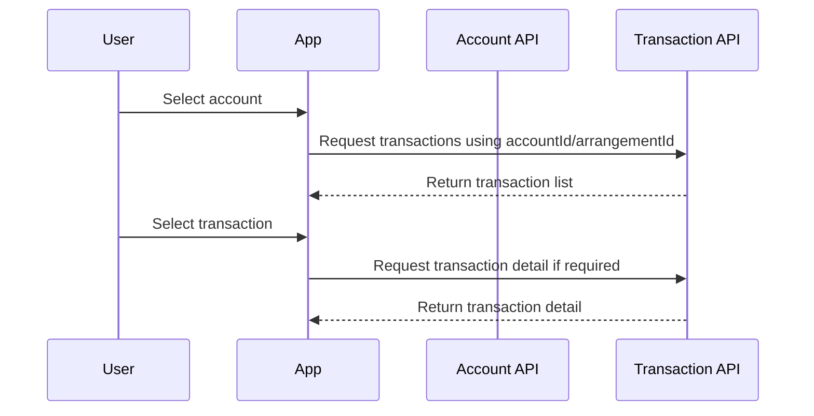

# 05 - Transaction History Journey

## 1. Objective

This journey explains how the app displays transaction history for a selected account/arrangement.

## 2. High-Level Flow



## 3. Step-by-Step Sequence

| Step | Action | API | Input | Output | Dependency |
|---|---|---|---|---|---|
| 1 | User opens account list | Account API | Token | Account list | Login + account journey |
| 2 | User selects account | N/A | `accountId/arrangementId` | Transaction screen | Account selected |
| 3 | App calls transaction list | Transaction API | Token + account/arrangement ID | Transaction list | Step 2 |
| 4 | User applies filters | Transaction API | Date range, type, page | Filtered list | Step 3 |
| 5 | User opens detail | Transaction Detail API | Transaction ID | Transaction detail | Step 3 output |

## 4. API Details

### 4.1 Transaction List API

**Method:** `GET`  
**Endpoint:** `To be confirmed from API reference`  
**Example placeholder:** `/accounts/{accountId}/transactions` or `/arrangements/{arrangementId}/transactions`

#### Headers

```http
Authorization: Bearer <access_token>
Accept: application/json
```

#### Path Parameters

| Parameter | Required | Description |
|---|---|---|
| `accountId` or `arrangementId` | Yes | Selected account/arrangement identifier |

#### Query Parameters - Placeholder

| Parameter | Description |
|---|---|
| `fromDate` | Start date |
| `toDate` | End date |
| `transactionType` | Debit/Credit/filter type |
| `page` | Pagination page |
| `size` | Page size |

#### Success Response - Placeholder

```json
{
  "transactions": [
    {
      "transactionId": "txn-001",
      "bookingDate": "2026-07-01",
      "description": "POS Purchase",
      "amount": -25.50,
      "currency": "USD",
      "type": "DEBIT",
      "status": "POSTED"
    }
  ],
  "page": 0,
  "size": 20,
  "totalElements": 1
}
```

### 4.2 Transaction Detail API

**Method:** `GET`  
**Endpoint:** `To be confirmed from API reference`

**Dependency:** Requires `transactionId` from transaction list API.

## 5. Dependency Mapping

| Data | Source | Used For |
|---|---|---|
| Access token | Login API | Authorization |
| Account ID / Arrangement ID | Account List API | Transaction lookup |
| Transaction ID | Transaction List API | Transaction detail |

## 6. Error Handling

| Scenario | Behaviour |
|---|---|
| No transactions | Show empty state |
| Invalid account ID | Navigate back / show data unavailable |
| Unauthorized account access | Show forbidden/access denied |
| Pagination failure | Keep current list and show retry |
