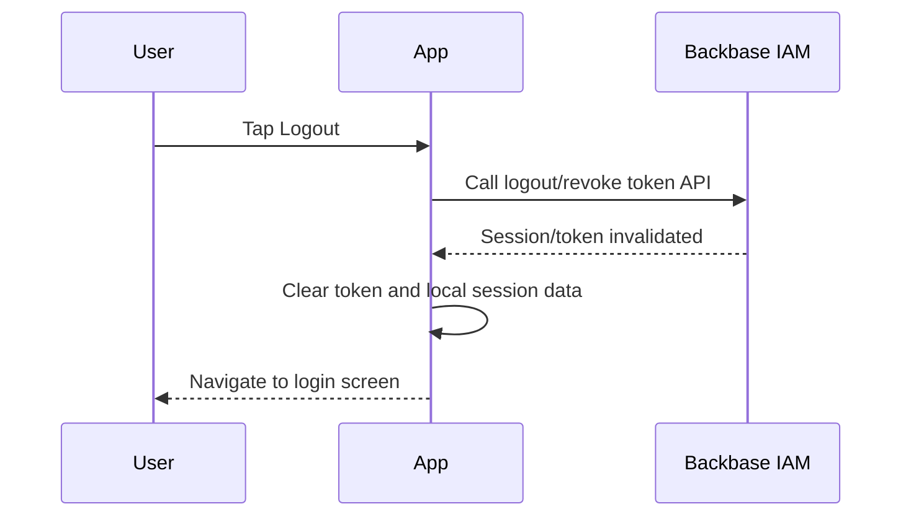

# 06 - Logout & Session Termination Journey

## 1. Objective

This journey explains how the application terminates the user session securely and removes local authentication/session data.

## 2. High-Level Flow



## 3. Step-by-Step Sequence

| Step | Action | API | Input | Output | Dependency |
|---|---|---|---|---|---|
| 1 | User taps Logout | N/A | User action | Logout confirmation optional | Active session |
| 2 | App calls logout/revoke API | IAM Logout API | Access token/refresh token | Session invalidated | Valid token |
| 3 | App clears local data | N/A | Stored token/session | Local auth cleared | Step 2 or fallback |
| 4 | App redirects | N/A | Cleared state | Login screen | Step 3 |

## 4. API Details

### 4.1 Logout / Token Revocation API

**Method:** `POST`  
**Endpoint:** `To be confirmed from Backbase IAM API reference`

#### Headers

```http
Authorization: Bearer <access_token>
Content-Type: application/json
```

#### Request Body - Placeholder

```json
{
  "refresh_token": "<refresh_token>"
}
```

#### Success Response - Placeholder

```json
{
  "status": "SUCCESS",
  "message": "Session terminated"
}
```

## 5. Important Behaviour

- Local token/session data must be cleared even if logout API fails due to network issue.
- User must not remain inside the app after logout action.
- Cached sensitive data should be cleared or invalidated.
- Biometric/session shortcuts should be reset based on security rules.

## 6. Error Handling

| Scenario | Behaviour |
|---|---|
| Logout API success | Clear local session and redirect |
| Logout API timeout | Clear local session and redirect; optional background retry |
| Token already expired | Clear local session and redirect |
| Server error | Clear local session; do not keep user logged in |
